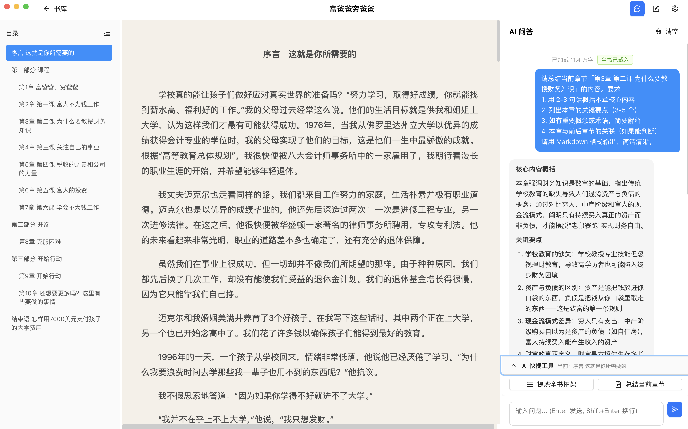

<div align="center">

# 📖 智能读书笔记

**EPUB 阅读 · AI 问答 · 语音笔记 · Obsidian 导出**

一款桌面端智能阅读应用，让 AI 成为你的私人读书助手

[](LICENSE)
[]()
[](https://www.electronjs.org/)
[](https://react.dev/)

</div>

---



## ✨ 功能亮点

<table>
<tr>
<td width="50%">

### 📚 EPUB 阅读器
- 导入并阅读 EPUB 格式电子书
- 章节目录导航，支持折叠/展开
- 自动保存阅读进度，下次从上次位置继续
- 可调节字体大小、字体类型、阅读主题
- 面板可拖拽调整宽度

</td>
<td width="50%">

### 🤖 AI 智能问答
- 基于书籍内容智能问答
- 短书全文载入，长书智能检索相关章节
- 一键提炼全书框架、总结当前章节
- 流式输出，实时显示回答
- 支持混元 / Kimi / GLM / MiniMax 等模型

</td>
</tr>
<tr>
<td width="50%">

### 📝 智能笔记
- 文本笔记：支持 macOS 原生语音输入
- AI 整理：一键将口语化内容整理为书面笔记
- 语音笔记：录音 → Whisper 本地转写 → AI 整理
- Markdown 渲染，支持编辑与删除

</td>
<td width="50%">

### 🔗 Obsidian 导出
- 将书籍笔记导出为 Obsidian 知识库格式
- 支持单本或全部书籍批量导出
- AI 自动生成章节摘要
- 无缝融入个人知识管理工作流

</td>
</tr>
</table>

## 🛠 技术栈

| 模块 | 技术 |
|:------|:------|
| 框架 | Electron + React + TypeScript |
| 构建 | Vite + electron-builder |
| EPUB 渲染 | epub.js |
| AI 接口 | OpenAI 兼容接口（腾讯云 Coding Plan 等） |
| 语音识别 | openai-whisper（本地运行） |
| 数据库 | better-sqlite3 |
| UI 组件 | Ant Design |
| 状态管理 | Zustand |

## 🚀 快速开始

### 方式一：下载安装包

前往 [Releases](../../releases) 页面下载最新版本的 `.dmg` 文件。

> 💡 首次打开可能提示"无法验证开发者"，右键点击 app → 打开，或在「系统设置 → 隐私与安全性」中允许。

### 方式二：从源码构建

```bash
# 克隆项目
git clone https://github.com/Owenchan007/smart-reader.git
cd smart-reader

# 安装依赖
npm install

# 重建原生模块（better-sqlite3）
npx electron-rebuild -f -w better-sqlite3

# 开发模式
npm run dev

# 打包
npm run build
```

## 📖 使用指南

1. **配置 API Key** — 点击顶部设置按钮，输入 API Key 并选择模型
2. **导入书籍** — 在书库页面点击「导入 EPUB」选择文件
3. **阅读** — 点击书籍封面进入阅读器
4. **AI 问答** — 切换到「AI 问答」面板，向 AI 提问
5. **笔记** — 切换到「笔记」面板，记录想法或开启 AI 整理

### 语音笔记（可选）

语音笔记依赖本地 Whisper，需提前安装：

```bash
pip install openai-whisper
```

> 首次使用会自动下载 Whisper Medium 模型（约 1.5 GB）。

## 📁 项目结构

```
smart-reader/
├── electron/                  # Electron 主进程
│   ├── main.ts               # 主进程入口
│   ├── preload.ts            # 预加载脚本（IPC 桥接）
│   ├── services/
│   │   ├── db.ts             # SQLite 数据库
│   │   ├── epub-parser.ts    # EPUB 解析与文本提取
│   │   ├── ai-client.ts      # AI API 调用（流式）
│   │   └── whisper.ts        # Whisper 语音识别
│   └── ipc/
│       └── handlers.ts       # IPC 处理器
├── src/                       # React 渲染进程
│   ├── App.tsx
│   ├── components/
│   │   ├── Reader/           # EPUB 阅读器
│   │   ├── Chat/             # AI 问答
│   │   ├── Notes/            # 笔记
│   │   └── Library/          # 书库
│   ├── stores/               # Zustand 状态管理
│   └── styles/
├── electron-builder.yml       # 打包配置
└── package.json
```

## 📄 License

[MIT](LICENSE)
